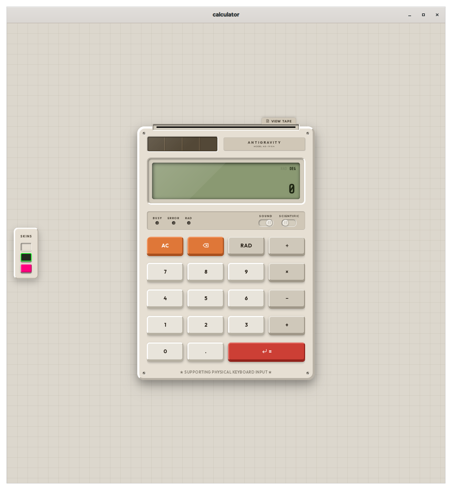
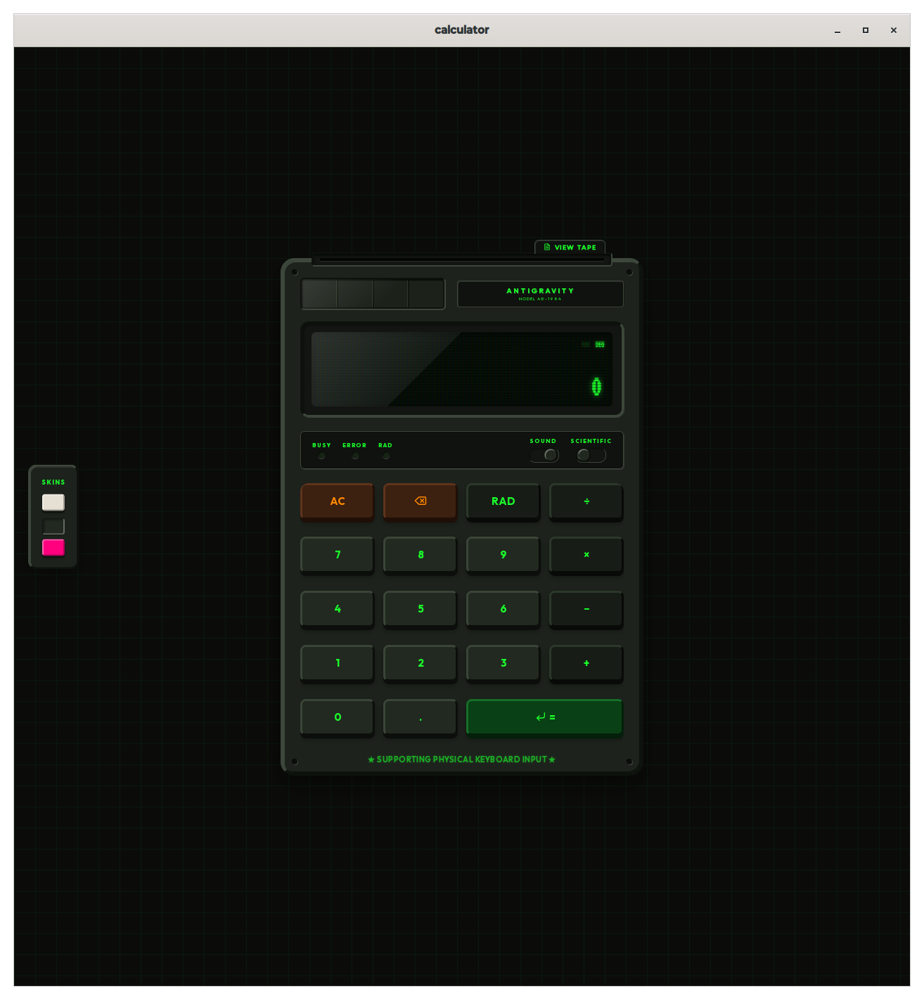
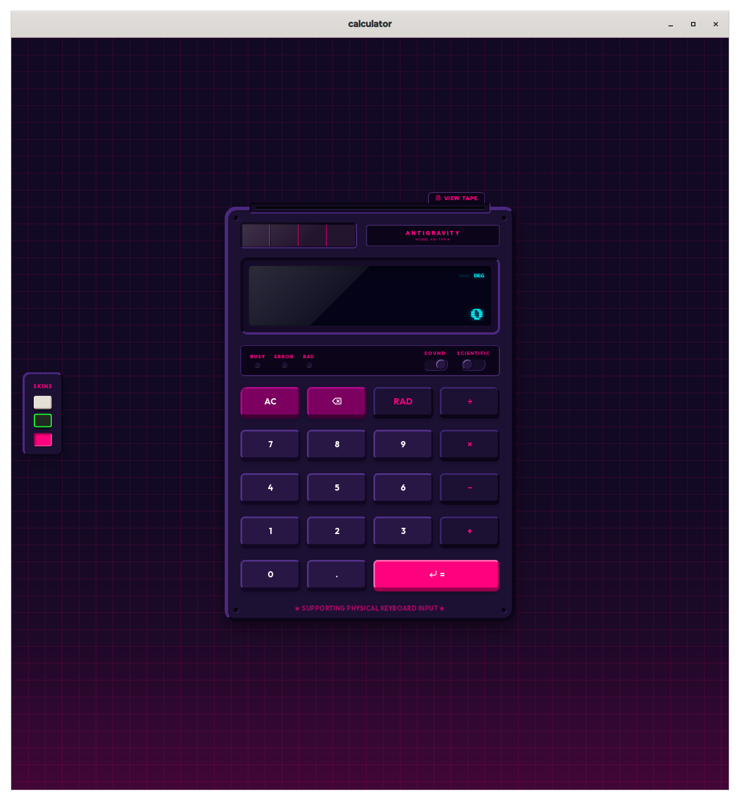
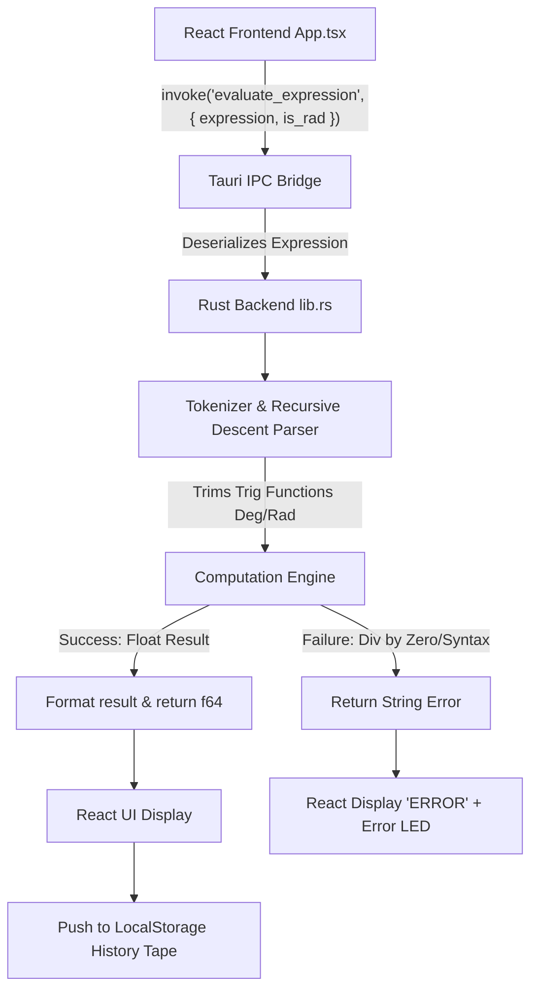

# Tauri + React + Typescript

This template should help get you started developing with Tauri, React and Typescript in Vite.

## Recommended IDE Setup

- [VS Code](https://code.visualstudio.com/) + [Tauri](https://marketplace.visualstudio.com/items?itemName=tauri-apps.tauri-vscode) + [rust-analyzer](https://marketplace.visualstudio.com/items?itemName=rust-lang.rust-analyzer)


# Retromorphic Calculator (AG-1984) — User & Architectural Manual

Welcome to the **Retromorphic Calculator (MODEL AG-1984)**. This project is built using the **Tauri Framework v2**, featuring a **Rust backend** for parsing/evaluation of algebraic expressions and a **React + TypeScript frontend** designed with extreme retromorphic visual fidelity.

> [!NOTE]
> All calculation parsing and arithmetic operations are offloaded to high-performance, safe, and robust Rust code executing via Tauri's inter-process invoke handler.

---

## Local Development

### Prerequisites

- [Rust](https://www.rust-lang.org/tools/install) (stable toolchain)
- [Bun](https://bun.sh/) (or Node.js 18+)
- Tauri v2 system dependencies — see [Tauri prerequisites](https://v2.tauri.app/start/prerequisites/)

### Setup & Run

```bash
# Clone the repo
git clone git@github.com:yashoswalyo/retromorphic-calculator.git
cd retromorphic-calculator

# Install frontend dependencies
bun install

# Run in development mode (launches the Tauri window with hot-reload)
bun run tauri dev

# Build a production binary
bun run tauri build
```

The dev server starts at `http://localhost:1420` and the Tauri window opens automatically.

---

## 🎨 Retromorphic Aesthetic & Design System

Retromorphism marries tactile 3D skeumorphism from 70s-90s hardware (like IBM Model M keyboards, retro Macintosh computers, office printing calculators, and vintage terminals) with modern, fluid, glassmorphic interfaces and responsive micro-animations.

We have implemented **three custom, beautiful skin modules** that completely transform the workspace:

### 1. IBM Classic 1984 (Beige Cassette)
*   **Chassis**: Warm computer cream beige (`#E6DFD3`) with deep 3D outlines.
*   **Display**: Olive-green liquid crystal display (LCD) with a realistic sub-pixel matrix overlay and a subtle glass sheen.
*   **LED Indicators**: Warm colored retro filament lamps for *Busy*, *Error*, and *Radian (RAD)* active modes.
*   **Tactile Keys**: Chunky cherry-profile mechanical keycaps with two-tone grey/beige mapping, a bright orange clear key, and a solid crimson red equal key.



### 2. Pip-Boy 3000 (Phosphor CRT Terminal)
*   **Chassis**: Dark military textured metal alloys with mechanical rivet detailing.
*   **Display**: Curved retro cathode-ray tube (CRT) display with high-contrast glowing green phosphor scanlines and a constant, organic phosphor refresh flicker.
*   **LED Indicators**: High-luminescence green and amber warning filaments.
*   **Tactile Keys**: Translucent military console buttons with glowing green labeling. Clicking them triggers a neon flash.



### 3. Cyber Sunset 1988 (Synthwave Neon Grid)
*   **Chassis**: Deep indigo outrun casing set against a neon pink landscape grid.
*   **Display**: Deep black screen backlighting with glowing neon cyan vector characters.
*   **LED Indicators**: Radiant purple and blue cyber-lamps.
*   **Tactile Keys**: Semi-transparent dark polymer keycaps glowing with hot pink and laser cyan margins.



---

## ⚙️ Core Engineering Architecture



### 1. The Rust Mathematical Parser (`src-tauri/src/lib.rs`)
Rather than relying on JavaScript's unsafe `eval()`, we wrote a **custom, recursive descent mathematical expression parser** in Rust. The parser operates with strict operator precedence:
1.  **Parentheses & Functions**: `(expression)`, `sqrt(x)`, `sin(x)`, `cos(x)`, `tan(x)`, `ln(x)`, `log(x)`
2.  **Powers**: `x ^ y` (right-associative)
3.  **Multiplication, Division, Modulo**: `*`, `/`, `%`
4.  **Addition, Subtraction**: `+`, `-`

#### Degree vs Radian Trig Conversion
*   The Rust compiler checks if the `is_rad` flag is passed from the UI.
*   If **DEG** mode is active, the parser automatically wraps all trigonometric inputs in a degree-to-radian conversion (`val.to_radians()`) before applying standard floating-point functions.

### 2. Audio Synthesis via Web Audio API (`src/App.tsx`)
To eliminate the overhead of external static files and ensure perfect, zero-latency feedback inside Tauri's webview, the calculator synthesizes its own physical sounds using the **Web Audio API** on the fly:
*   **Mechanical Click (`'key'`)**: Combines a quick pitch-sweeping triangle oscillator (650Hz to 100Hz) with a transient high-pass filtered white noise burst (cut off at 3.2kHz) to simulate the physical snap of a mechanical keyboard switch.
*   **Lever Shift (`'lever'`)**: Combines a low-frequency sawtooth wave with a quick amplitude decay to simulate a heavy spring-loaded metallic lever.
*   **Paper Roll hum (`'paper'`)**: Uses a low-frequency square wave (50Hz) hum to emulate the electric paper feed motor in vintage adding machines.

### 3. Scrollable History Paper Tape
Calculating with the **AG-1984** prints each operation onto a scrolling physical paper tape roll feeding out of a slot at the top.
*   **Visual Look**: Rendered in vintage typewriter fonts (`Courier Prime`), featuring authentic vertical red margin lines and a jagged serrated paper-rip edge (`clip-path`).
*   **State Persistence**: History is cached in `localStorage` and persists across application reboots.

---

## ⌨️ Physical Keyboard Mapping

The application listens to global keyboard events and maps them directly to the calculator board, highlighting the buttons visually to replicate tactile feedback:

| Physical Key | Calculator Action | Active Keycap Style |
| :--- | :--- | :--- |
| `0` - `9` | Appends digits | Outset 3D button presses down |
| `.` | Appends decimal separator | Outset 3D button presses down |
| `+` | Add | Operator highlighted orange/green/pink |
| `-` | Subtract | Operator highlighted orange/green/pink |
| `*` | Multiply | Operator highlighted orange/green/pink |
| `/` | Divide | Operator highlighted orange/green/pink |
| `%` | Modulo (mod) | Operator highlighted orange/green/pink |
| `^` | Power | Operator highlighted orange/green/pink |
| `Enter` or `=` | Evaluates expression | Equal button presses down |
| `Backspace` | Deletes last character | AC/DEL button presses down |
| `Escape` / `C` | Clears screen | AC/DEL button presses down |
| `R` / `r` | Toggles Radian / Degree mode | DEG/RAD indicator LED toggles |

---

## 🔬 Interactive Features Walkthrough

1.  **Solar Cell Power**: Hovering over the solar panel grid at the top displays a glossy sheen, representing an active solar generator feeding the board.
2.  **Sound Switch**: Flipping the `Sound` rocker switch silences or enables keypress click synthesis.
3.  **Scientific Lever**: Flipping the `Scientific` lever expands/collapses the extended panel containing scientific trigonometry buttons, constants ($\pi$, $e$), and parenthesis markers with a beautiful CSS width transition.
4.  **Tear Paper**: Clicking **Clear Tape** or **Tear** in the slide-out history paper strip resets your session logs with a satisfying sound.
